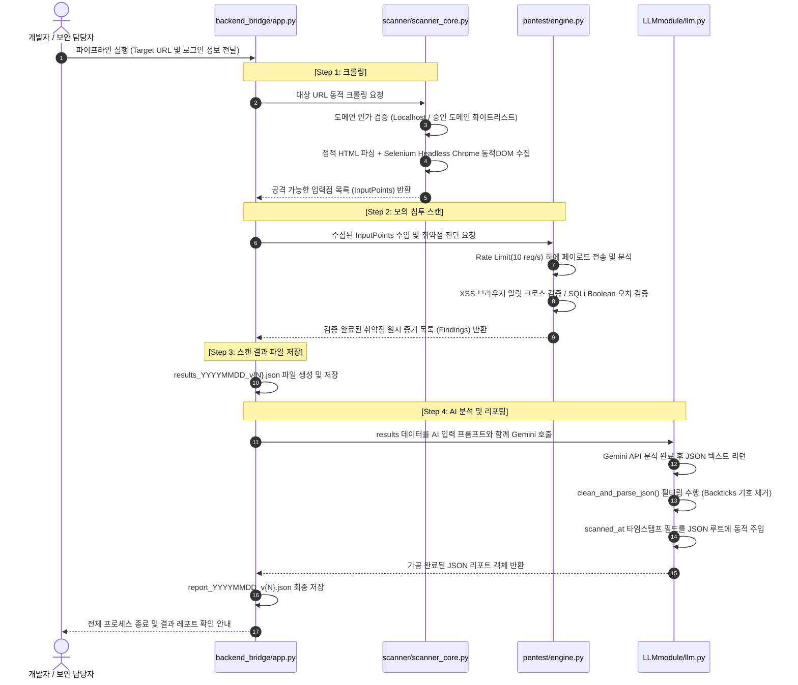
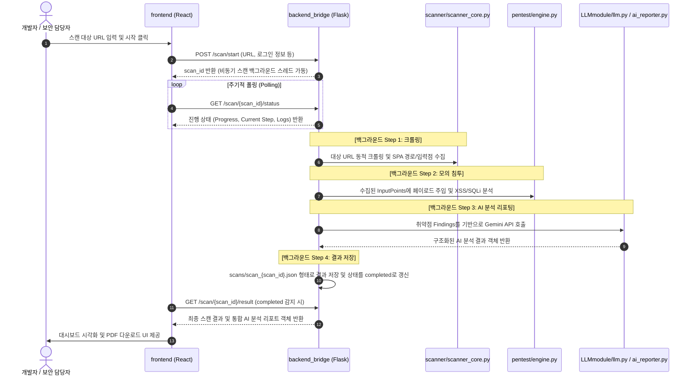

# 🛡️ Scaield: 자동화 DAST 스캐너 & AI 보안 리포트 통합 플랫폼

Scaield(Scanner AI Shield)는 자동화된 **DAST(Dynamic Application Security Testing) 취약점 스캐너**와 **LLM(Gemini) 보안 코칭 엔진**을 통합하여 설계된 엔드투엔드 웹 보안 진단 솔루션입니다. 

웹 애플리케이션의 프론트 및 백엔드 영역을 지능적으로 크롤링하여 SQL Injection 및 Cross-Site Scripting(XSS) 취약점을 정밀 식별하고, 개발자가 즉시 패치할 수 있는 수준의 **구조화된 시큐어 코딩 가이드와 비즈니스 영향도 분석 리포트**를 JSON 포맷으로 자동 생성합니다.

---

## 1. 아키텍처 개요 및 디렉토리 구조

Scaield는 각 역할별로 완벽하게 캡슐화된 모듈들로 구성되어 있으며, 백엔드 엔진과 React 프론트엔드가 결합하여 강력한 실시간 스캔 환경을 제공합니다.

```
Scaield/
├── backend_bridge/
│   ├── app.py                 # 전체 시스템 통합 실행 파이프라인 (Flask API 서버)
│   └── README.md              # 백엔드 브릿지 명세서
├── scanner/
│   ├── scanner_core.py        # 정적/동적 DOM 크롤러 및 타겟 도메인 인가 검증 엔진
│   ├── app.py                 # Flask 기반 독자 대시보드 웹 애플리케이션
│   ├── dashboard.py           # Streamlit 기반 실시간 스캔 & 결과 시각화 대시보드
│   ├── ai_reporter.py         # Stage 2: Gemini AI 기반 개별 취약점 분석 리포터
│   └── diagnose_dvwa.py       # DVWA 취약점 진단 특화 스크립트
├── pentest/
│   ├── engine.py              # 모의 침투(Pentest) 오케스트레이터
│   ├── scanner.py             # XSS / SQLi (Error-based, Boolean-based) 모의 침투 스캐너
│   ├── http_client.py         # 10 req/s 글로벌 Rate Limiter 내장 HTTP 클라이언트
│   ├── rate_limiter.py        # 속도 제한 및 연속 실패 임계치(5회) 감시 서킷 브레이커
│   ├── response_analyzer.py   # 응답 반사 체크, 에러 검출, Boolean 응답 논리 비교 분석 모듈
│   ├── crawler.py             # BFS 기반 정적 HTML 폼 크롤러
│   ├── payload.py             # 보안 진단용 Exploit 페이로드 세트
│   ├── models.py              # 데이터 구조체 모델 선언부 (Finding, InputPoint 등)
│   └── adapter.py             # 모의 침투 결과 ➡️ AI 입력용 데이터 어댑터 레이어
├── LLMmodule/
│   ├── llm.py                 # Gemini Pro API 연동 및 JSON 정제 모듈 (통합 리포트 생성)
│   └── README.md              # AI 모듈 상세 명세서
├── backend_bridge/            # React 프론트엔드와 기존 Scaield 모듈을 연결하는 Flask 브릿지 서버
│   ├── app.py                 # 브릿지 API 서버 (Port 8000)
│   ├── .env.example           # 백엔드 브릿지 환경 변수 예시
│   └── README.md              # 백엔드 브릿지 명세서
├── frontend/                  # React + Vite 기반의 차세대 보안 진단 통합 웹 대시보드
│   ├── src/
│   │   ├── App.jsx            # 대시보드 메인 UI 및 스캔 관리 화면
│   │   └── styles.css         # UI 스타일링 (CSS)
│   ├── package.json           # 프론트엔드 의존성 및 스크립트 설정
│   └── README.md              # 프론트엔드 설치 및 실행 가이드
├── common/                    # 공유 패키지 의존성 파일
├── scans/                     # [Output] 브릿지 서버를 통해 수행된 스캔 결과 아카이브 디렉토리
├── .env                       # API Key 및 환경 변수 파일 (Git 커밋 금지)
└── .gitignore                 # 원시 결과 및 가상환경(.venv*) 추적 제외 필터 설정 파일
```

---

## 2. 엔드투엔드 파이프라인 및 데이터 플로우

통합 파이프라인(`backend_bridge/app.py`)은 실행 시 아래의 4단계를 연속적으로 수행하며 동작합니다.



### B. 웹 대시보드(Frontend/Backend Bridge) 비동기 스캔 흐름


---

## 3. 핵심 비기능적 요구사항 (Non-Functional Requirements)

* **NFR1: 글로벌 속도 제한 및 장애 내성 (Global Rate Limiting & Fault Tolerance)**
  * 진단 시스템의 폭주나 타겟 서버의 마비를 예방하기 위해, `pentest/http_client.py`는 데코레이터 패턴과 락킹 매커니즘을 결합한 글로벌 Rate Limiter를 내장하여 **초당 최대 10회 요청(10 req/sec)** 범위 내에서 엄격하게 지연 처리가 이루어집니다.
  * 또한 `pentest/rate_limiter.py`는 연속 실패 횟수가 설정된 임계치(기본 5회)를 초과할 경우 `RateLimiterError` 예외를 발생시키고 스캔을 즉시 조기 중단(Fail-fast)하여 불필요한 과부하를 차단합니다.
* **NFR2: 브라우저 가상 환경(Selenium) 및 BFS 크롤러 이중화 검증**
  * XSS 스캐너는 단순 정적 텍스트 매칭을 배제하고, 셀레늄 크롬 드라이버(`webdriver.Chrome`)를 백그라운드 무인(Headless) 모드로 띄워 실제 DOM 컨텍스트 내에서 스크립트 실행이 트리거되어 경고창(Alert)이 활성화되는지 물리적 이벤트를 직접 검출합니다.
  * 추가적으로 `pentest/crawler.py`는 requests와 BeautifulSoup를 활용한 BFS 기반 크롤러를 도입하여 가벼우면서도 효과적인 페이지 탐색 및 폼 입력점 수집을 교차 지원합니다.
* **NFR3: 강건한 데이터 정제 및 폴백(Fallback) 메커니즘**
  * LLM API 응답에 장식용 마크다운 백틱 기호(```` ```json ```` 등)가 섞여서 반환되는 고질적인 문제를 정적 패턴 매칭 필터로 안전하게 걸러내어, 저장되는 파일이 언제나 100% 온전하게 파싱 가능한 JSON 문법 규격을 유지하도록 보장합니다.
  * `GEMINI_API_KEY`가 누락되었거나 구글 generativeai 라이브러리가 미설치된 환경, 혹은 API 통신 장애 발생 시에도 전체 진단 파이프라인이 다운되지 않고, `fallback`용 요약 안내 리포트를 생성하여 전체 시스템의 견고성(Robustness)을 유지합니다.

---

## 4. 환경 변수 및 가상환경 설정 가이드

### 1단계: 의존성 패키지 설치
Python 3.11+ 환경으로 구성된 가상환경을 활성화하고 필수 라이브러리 목록을 설치 및 업데이트합니다.

```bash
# 1. 가상환경 활성화 (zsh 기준)
source .venv/bin/activate

# 2. pip 자가 업데이트 및 패키지 일괄 설치
pip install --upgrade pip
pip install -r requirements.txt
```

### 2단계: `.env` 환경 변수 설정
프로젝트 루트 디렉토리에 `.env` 파일을 생성하고 구글 AI Studio에서 발급받은 Gemini API 키와 프론트엔드 연결용 API URL을 설정합니다.

```env
# Scaield AI API Key Configuration
GEMINI_API_KEY=your_gemini_api_key_here
VITE_API_BASE_URL=http://localhost:8000
```
> [!NOTE]
> Scaield의 환경 변수 로더는 안전망 코드가 보강되어 있어, `.env` 값에 실수로 큰따옴표(`"`)나 작은따옴표(`'`)를 감싸두더라도 로딩 시점에 자동으로 외따옴표를 벗겨내어 온전한 API 키만 API 호출 모듈에 전달합니다.

---

## 5. 입력 및 출력 데이터 스키마

### [스캔 결과 원시 데이터 스키마] (`results_YYYYMMDD_vN.json`)
```json
{
  "meta": {
    "target_url": "진단 대상 주소 (string)",
    "scanned_at": "스캔 일시 (ISO 8601 string)",
    "input_points": "수집된 폼/쿼리 파라미터 개수 (int)",
    "total_findings": "탐지된 취약점 총 개수 (int)"
  },
  "findings": [
    {
      "target_url": "취약점 발견 상세 URL (string)",
      "vulnerability_type": "취약점 대분류 명칭 (string)",
      "parameter": "취약성 노출 파라미터명 (string)",
      "payload": "모의 침투 성공 페이로드 (string)",
      "http_method": "GET / POST",
      "status_code": "응답 상태 코드 (int)",
      "response_body_excerpt": "응답 본문 핵심 일부 발췌 (string)",
      "confidence": "high / medium / low",
      "evidence": {
        "detection_method": "탐지 유형 설명",
        "detail": "시그니처 매칭이나 논리 비교 상세 증거"
      }
    }
  ]
}
```

### [AI 분석 리포트 데이터 스키마] (`report_YYYYMMDD_vN.json`)
```json
{
  "scanned_at": "리포트가 최종 작성 및 파싱 완료된 타임스탬프 (ISO 8601 string)",
  "dashboard_view": {
    "vulnerability_title": "공식 취약점 위협 분류 (string)",
    "risk_level": "위험도 등급 (High, Medium, Low 중 택 1)",
    "affected_parameter": "진입점 파라미터 정보 (string)",
    "brief_summary": "대시보드 화면용 요약 구문 (string)"
  },
  "pdf_report_view": {
    "technical_root_cause": "외부 증거에 입각하여 유추한 근본적인 기술적 원인 분석 (string)",
    "business_impact_scenario": "악의적인 침입자가 이를 조작 및 악용 시 비즈니스에 가해지는 구체적인 모의 침투 시나리오 (string)",
    "secure_code_example": "취약 환경(언어/프레임워크)에 대응하여 Prepared Statement 등을 적용한 방어 코드 스니펫 (Markdown string)",
    "remediation_guidance": "개발 실무자가 따라야 할 조치 이행 절차 (string)",
    "validation_checklist": [
      "패치 검증용 QA 체크리스트 항목 1 (string)",
      "패치 검증용 QA 체크리스트 항목 2 (string)"
    ],
    "disclaimer": "법적 면책 사항 안내 고정구문 (string)"
  }
}
```

### [웹 대시보드용 통합 스캔 결과 스키마] (`scans/scan_*.json`)
```json
{
  "scan_id": "브릿지에서 부여한 고유 스캔 ID (string)",
  "target_url": "진단 대상 주소 (string)",
  "scan_time": "총 소요 시간 (e.g. 5초, 2분 10초)",
  "started_at": "스캔 시작 시각 (ISO 8601 string)",
  "finished_at": "스캔 종료 시각 (ISO 8601 string)",
  "total_pages": "크롤링 완료된 하위 페이지 개수 (int)",
  "tested_inputs": "테스트 완료된 인풋 포인트 수 (int)",
  "detected_counts": {
    "SQL Injection": 1,
    "Cross-Site Scripting": 2
  },
  "risk_level": "High / Medium / Low",
  "report_status": "AI 리포트 처리 현황 (string)",
  "vulnerabilities": [
    {
      "id": "vuln-1",
      "type": "취약점 종류 (string)",
      "risk_level": "High / Medium / Low",
      "endpoint": "발견된 엔드포인트 URL (string)",
      "parameter": "취약 파라미터명 (string)",
      "payload": "공격 페이로드 (string)",
      "status_code": "서버 응답 상태 코드 (int)",
      "evidence": "상세 오차 증거 및 응답 분석 내용 (string)",
      "detection_method": "탐지 기법 (string)",
      "ai_report": {
        "vulnerability_summary": "취약점 설명 요약 (string)",
        "root_cause": "근본 원인 분석 (string)",
        "risk_level": "위험도 (string)",
        "attack_scenario": "비즈니스 영향 및 공격 시나리오 (string)",
        "secure_coding_guidance": "조치 방안 가이드 (string)",
        "fixed_code_example": "시큐어 코딩 방어 코드 스니펫 (string)",
        "validation_steps": "패치 검증 가이드라인 (string)",
        "disclaimer": "법적 고지 (string)"
      }
    }
  ]
}
```

---

## 6. 사용법 및 CLI 가이드

### CLI 전체 옵션 안내

| 옵션명 | 필수 여부 | 기본값 | 설명 |
| :--- | :---: | :--- | :--- |
| `--url URL` | **Yes** | - | 웹 보안 취약점을 탐색 및 진단할 타겟 루트 URL 주소 |
| `--approved-domains DOMAINS`| No | `""` | 로컬호스트 주소 이외에 진단을 추가적으로 허용할 승인 도메인 목록 (쉼표 구분) |
| `--timeout SEC` | No | `10` | 스캐너의 HTTP 요청 타임아웃 제한 값 (초 단위) |
| `--output PATH` | No | `results.json` | 결과 파일들이 저장될 부모 경로 디렉토리 및 디폴트 파일명 설정 |
| `--login-url URL` | No | `""` | 인증 영역 스캔 전 자동 세션 획득을 수행할 로그인 엔드포인트 URL |
| `--login-user USER` | No | `""` | 자동 로그인 입력용 사용자 아이디 |
| `--login-pass PASS` | No | `""` | 자동 로그인 입력용 비밀번호 |
| `--login-user-field FIELD` | No | `username` | 로그인 HTML 폼 내부 아이디 필드의 `name` 식별자명 |
| `--login-pass-field FIELD` | No | `password` | 로그인 HTML 폼 내부 비밀번호 필드의 `name` 식별자명 |
| `--ai-provider PROVIDER` | No | `""` | 연동할 외부 LLM 벤더 정보 (`gemini`) |
| `--ai-key KEY` | No | `""` | LLM API 키 직접 인가 시 설정 (보통은 `.env`에서 불러오므로 미지정) |
| `--ai-model MODEL` | No | `""` | 적용할 특정 LLM 모델 명칭 |

---

### API 서버 실행

우선 백엔드 통합 파이프라인 서버를 기동합니다:

```bash
python3 backend_bridge/app.py
```
(기본적으로 `0.0.0.0:8000`에서 실행됩니다)

### 스캔 요청 예시 (cURL)

#### 예시 A: 일반 비인가 영역 기본 통합 스캔
```bash
curl -X POST http://localhost:8000/scan/start \
  -H "Content-Type: application/json" \
  -d '{"target_url": "http://localhost:55000/"}'
```

#### 예시 B: DVWA 모의 침투 대상 계정 자동 세션 수집 및 심층 스캔
Scaield의 자동 세션 기능(`LoginConfig`)을 적용하여 관리자 계정 로그인 후 세션 쿠키를 자동 물려받아 보안 진단 및 분석 리포트 제작까지 한 번에 동작시키는 예시입니다.
```bash
curl -X POST http://localhost:8000/scan/start \
  -H "Content-Type: application/json" \
  -d '{
    "target_url": "http://localhost:55000/",
    "login": {
      "login_url": "http://localhost:55000/login.php",
      "username": "admin",
      "password": "password",
      "username_field": "username",
      "password_field": "password"
    }
  }'
```

---

> [!IMPORTANT]
> **면책 조항 (Legal Disclaimer)**  
> Scaield 파이프라인에서 생성된 리포트와 보안 대응 코드 스니펫은 웹 어플리케이션 스캐너의 외부 관측 결과(Black-box DAST)에 기초하여 AI 엔진이 추정한 모의 예시입니다. 실제 프로덕션 환경이나 라이브 서비스 소스코드에 보안 패치를 적용하기 전, 반드시 사내 보안 전담 팀 및 시니어 엔지니어의 구조적 리뷰와 검증을 완료한 후 반영하여 주시기 바랍니다. 본 도구를 통해 발생하는 모든 시스템 오작동이나 침해 사고의 최종 책임은 사용자에게 있습니다.
