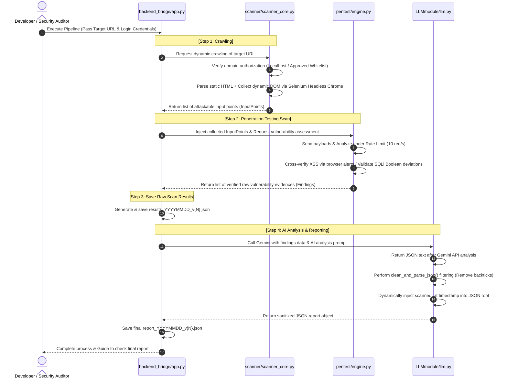

## 2. 엔드투엔드 파이프라인 및 데이터 플로우

통합 파이프라인(`backend_bridge/app.py`)은 실행 시 아래의 4단계를 연속적으로 수행하며 동작합니다.

```mermaid
sequenceDiagram
    autonumber
    actor User as Developer / Security Auditor
    participant Run as backend_bridge/app.py
    participant Core as scanner/scanner_core.py
    participant Pentest as pentest/engine.py
    participant LLM as LLMmodule/llm.py
    
    User->>Run: Execute Pipeline (Pass Target URL & Login Credentials)
    
    Note over Run, Core: [Step 1: Crawling]
    Run->>Core: Request dynamic crawling of target URL
    Core->>Core: Verify domain authorization (Localhost / Approved Whitelist)
    Core->>Core: Parse static HTML + Collect dynamic DOM via Selenium Headless Chrome
    Core-->>Run: Return list of attackable input points (InputPoints)
    
    Note over Run, Pentest: [Step 2: Penetration Testing Scan]
    Run->>Pentest: Inject collected InputPoints & Request vulnerability assessment
    Pentest->>Pentest: Send payloads & Analyze under Rate Limit (10 req/s)
    Pentest->>Pentest: Cross-verify XSS via browser alerts / Validate SQLi Boolean deviations
    Pentest-->>Run: Return list of verified raw vulnerability evidences (Findings)
    
    Note over Run: [Step 3: Save Raw Scan Results]
    Run->>Run: Generate & save results_YYYYMMDD_v{N}.json
    
    Note over Run, LLM: [Step 4: AI Analysis & Reporting]
    Run->>LLM: Call Gemini with findings data & AI analysis prompt
    LLM->>LLM: Return JSON text after Gemini API analysis
    LLM->>LLM: Perform clean_and_parse_json() filtering (Remove backticks)
    LLM->>LLM: Dynamically inject scanned_at timestamp into JSON root
    LLM-->>Run: Return sanitized JSON report object
    Run->>Run: Save final report_YYYYMMDD_v{N}.json
    Run-->>User: Complete process & Guide to check final report
```